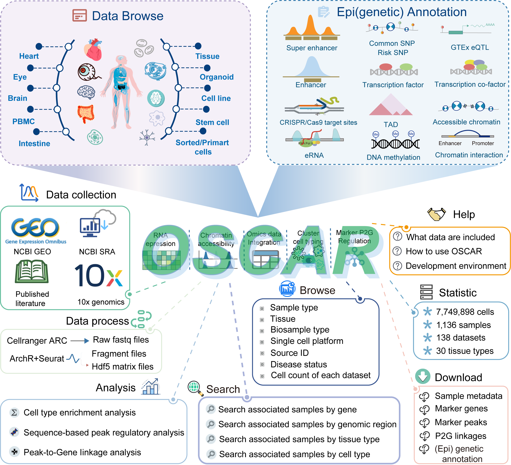

# Welcome to OSCAR!

> **OSCAR:** [https://bio.liclab.net/OSCAR/](https://bio.liclab.net/OSCAR/)
>
> OSCAR is a human single-cell multi-omics platform for paired RNA-seq and ATAC-seq data.

---

## Contact us

**Principal Investigator:** Chunquan Li, Ph.D.

The First Affiliated Hospital, University of South China, Hengyang 421001, China

**Email:** [lcqbio@163.com](mailto:lcqbio@163.com)
